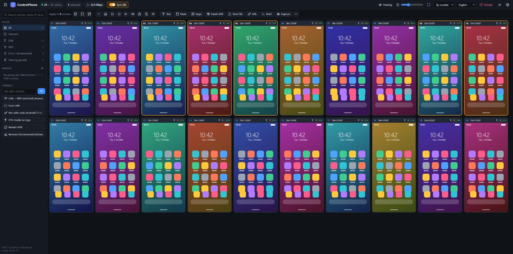
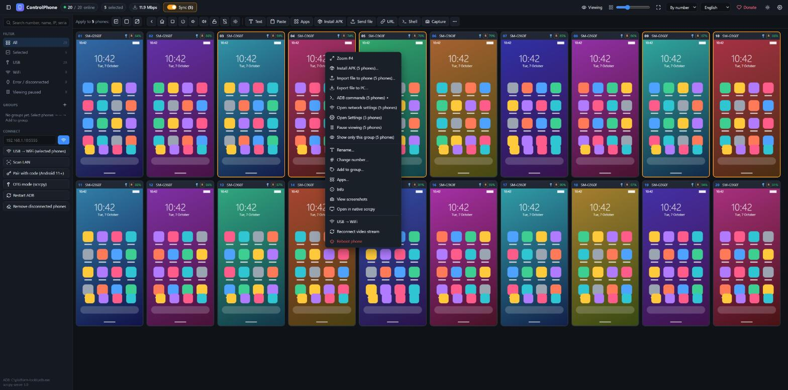

<div align="center">

# 📱 ControlPhone

**Phần mềm miễn phí, mã nguồn mở để xem và điều khiển hàng loạt điện thoại Android cùng lúc — xem trực tiếp mọi màn hình, điều khiển 1 máy hoặc cả nhóm đồng bộ.**

**Không giới hạn thiết bị · Không quảng cáo · Không tác vụ chạy ngầm · Đã tối ưu để nhẹ nhàng nhất**

Tiếng Việt · [English](README.md)

Ngôn ngữ giao diện: Tiếng Việt · English · 简体中文 · 繁體中文 · Deutsch · Français



<sub>Màn hình điện thoại trong ảnh là hình minh hoạ.</sub>

</div>

---

## ✨ Điểm nổi bật

| | |
|---|---|
| ♾️ **Không giới hạn thiết bị** | Không giới hạn số máy, không key bản quyền, không bản "Pro". Thiết kế cho 100+ máy trên một máy tính (đã chạy thật 20 máy, đo thử 100 luồng hình). |
| 🚫 **Không quảng cáo, không theo dõi** | Không quảng cáo, không thu thập dữ liệu, không cần tài khoản. Phần mềm chỉ làm việc với điện thoại và máy tính của bạn (chỉ dùng Internet một lần để tải scrcpy khi cài đặt). |
| 💤 **Không tác vụ chạy ngầm** | Không cài dịch vụ, không tự chạy cùng Windows. Đóng cửa sổ máy chủ là mọi thứ dừng hẳn. Không cài ứng dụng nào lên điện thoại — trình truyền hình (1 tệp nhỏ trong `/data/local/tmp`) chỉ chạy khi đang kết nối. |
| 🪶 **Tối ưu nhẹ nhất** | Điện thoại mã hoá H.264 bằng phần cứng, máy tính giải mã ngay trong trình duyệt (WebCodecs). Máy đứng yên chỉ tốn khoảng 6 kbps; máy bị cuộn khuất hoặc tạm dừng không gửi gì. |
| 🆓 **Miễn phí, mã nguồn mở** | Giấy phép MIT: dùng, sửa, chia sẻ thoải mái. |

## 🚀 Tính năng

**Lưới màn hình trực tiếp**
- Xem tất cả máy trong lưới, đổi kích thước ô, "vừa khít màn hình" bằng 1 nút.
- Lưới dùng luồng nhẹ (360p–720p, tuỳ chỉnh); màn hình lớn dùng luồng nét riêng (tới 1280px / 30 fps).
- Chỉ giải mã các ô đang nhìn thấy; thu nhỏ cửa sổ là tạm dừng hết.
- **Tạm dừng xem** 1 máy hoặc 1 nhóm (máy ngừng gửi hình nhưng vẫn điều khiển được).
- **Chỉ hiển thị các máy này**: ẩn và tạm dừng mọi máy khác, bấm 1 nút để trở lại.

**Điều khiển trực tiếp trên màn hình nhỏ**
- Chuột = ngón tay trên mọi ô: chạm, vuốt, nhấn giữ. Chuột giữa = Home, nút bên chuột = Quay lại, Shift + lăn chuột = cuộn, Alt + kéo = thu phóng 2 ngón.
- Gõ phím khi trỏ chuột vào máy; **Ctrl+V dán clipboard máy tính vào tất cả máy đang chọn** (mọi ngôn ngữ, emoji).
- **Click** = chọn 1 máy · **Ctrl+click** = thêm/bớt máy vào nhóm · kéo khung = chọn nhiều · Ctrl+A = tất cả.
- **Tự động đồng bộ**: khi chọn từ 2 máy, thao tác trên một máy trong nhóm được lặp lại trên cả nhóm (F3 để tạm tắt).
- **Tắt màn hình thật** của điện thoại mà vẫn xem và điều khiển được (tiết kiệm pin; thoát app màn hình tự bật lại). Bật sẵn mặc định.

**Menu chuột phải trên mỗi máy**



1. Phóng to (màn hình lớn của máy đó; nếu thuộc nhóm vẫn đồng bộ)
2. Cài APK
3. Nhập tệp vào máy
4. Xuất tệp ra máy tính
5. Lệnh ADB ▸ (thông tin máy, pin, bộ nhớ, RAM, IP/WiFi, ứng dụng đang mở, danh sách ứng dụng, ẩn/hiện thanh 3 nút, bật/tắt WiFi & dữ liệu, dọn cache, đóng app nền, đặt pin 100% / khôi phục pin thật, lệnh tuỳ chỉnh, khởi động lại)
6. Mở cài đặt mạng
7. Mở Cài đặt

**Thao tác hàng loạt (cho các máy đang chọn)**
- Quay lại / Home / Đa nhiệm / Nguồn / Âm lượng / Mở khoá / Tắt-bật màn hình
- Gửi văn bản, dán, mở URL, mở / dừng / xoá dữ liệu / gỡ ứng dụng
- Cài APK (hoặc kéo thả tệp `.apk` vào cửa sổ), gửi tệp, trình duyệt tệp (tải về / tải lên / xoá)
- ADB shell (có thể chạy root) kèm kết quả từng máy, chụp màn hình hàng loạt
- Đổi tên, đánh số, nhóm, bộ lọc, tìm kiếm, xem pin & nhiệt độ

**Kết nối**
- **USB** — nhận máy ngay khi cắm.
- **WiFi** — USB → WiFi bằng 1 nút (và WiFi → USB để chuyển lại), kết nối theo IP, quét mạng LAN, ghép nối mã (Android 11+). Máy có cả USB và WiFi chỉ hiện 1 ô và tự chuyển khi mất kết nối; máy WiFi tự kết nối lại.
- **Root** — tự nhận; shell root, bật ADB WiFi cố định.
- **OTG** — mở `scrcpy --otg` (bàn phím/chuột qua USB, không cần Gỡ lỗi USB).
- Mở cửa sổ scrcpy gốc cho từng máy khi cần.

## 📥 Cài đặt

### Cách 1 — Bản ZIP (khuyên dùng, không cần cài thêm gì)
1. Tải `ControlPhone-vX.Y.Z-win64.zip` ở mục [Releases](https://github.com/mahiepit/ControlPhone/releases).
2. Giải nén ra thư mục bất kỳ.
3. Nhấp đúp **`ControlPhone.bat`**.

Bản ZIP đã có sẵn Node.js di động và scrcpy chính hãng.

### Cách 2 — Chạy từ mã nguồn
Yêu cầu: Windows 10/11, [Node.js 18+](https://nodejs.org), Microsoft Edge hoặc Google Chrome.
```bash
git clone https://github.com/mahiepit/ControlPhone.git
cd ControlPhone
npm install
npm run setup
npm start
```
`npm run setup` tải scrcpy v5.0 từ trang phát hành chính thức trên GitHub và kiểm tra mã SHA-256. `ControlPhone.bat` tự làm tất cả các bước này.

### Trên mỗi điện thoại
1. Bật **Tuỳ chọn nhà phát triển** → **Gỡ lỗi USB**.
2. Cắm USB và bấm **Cho phép** trên điện thoại.

Xong — vài giây sau máy hiện trong lưới. Không cài ứng dụng nào lên điện thoại.

## 🖱️ Thao tác nhanh

| Việc | Cách làm |
|---|---|
| Chọn 1 máy | Click thanh tiêu đề ô (hoặc chạm vào máy nằm ngoài nhóm) |
| Tạo nhóm | Ctrl+click các máy, kéo khung, hoặc Ctrl+A |
| Điều khiển cả nhóm | Thao tác trên bất kỳ máy nào trong nhóm (tự đồng bộ, F3 để tạm tắt) |
| Màn hình lớn | Chuột phải → Phóng to, hoặc nhấp đúp thanh tiêu đề ô |
| Dán vào các máy đang chọn | Ctrl+V |
| Menu của máy | Chuột phải vào máy |
| Tạm dừng 1 máy / 1 nhóm | Chuột phải → Tạm dừng xem |
| Chỉ xem vài máy | Chuột phải → Chỉ hiển thị máy này / nhóm này (nút tím trên cùng để trở lại) |
| Đổi ngôn ngữ | Ô chọn ngôn ngữ ở góc trên bên phải |
| Chất lượng & tuỳ chọn | ⚙ Cài đặt |

## ⚡ Hiệu năng

Đo trên máy tính Windows 22 luồng CPU, 20 điện thoại đang chạy game 3D (máy nào cũng chạy kịch trần 15 khung/giây):

| | 20 máy (Cân bằng) | 20 máy (Siêu nhẹ) | Ước tính 100 máy (Siêu nhẹ) |
|---|---|---|---|
| Tổng băng thông hình | 12 Mbps | 6,3 Mbps | ~32 Mbps |
| Trình duyệt (giải mã + vẽ) | 0,8 nhân | 0,6 nhân | ~3 nhân |
| Máy chủ ControlPhone | 0,1 nhân, ~100 MB RAM | 0,07 nhân | ~0,35 nhân |
| Trên điện thoại (scrcpy) | 1,5–3 % CPU | — | — |

Thử giải mã: 100 luồng × 15 khung/giây (1.500 khung/giây) mà giao diện vẫn 60 khung/giây.
Máy đứng yên chỉ tốn khoảng 6 kbps.

**Mẹo cho 100 máy:** dùng mức *Siêu nhẹ*, chia điện thoại ra nhiều bộ điều khiển USB (mỗi bộ thường chỉ nhận được vài chục máy), và tạm dừng xem các máy không cần theo dõi.

## ❓ Khắc phục sự cố

- **Ô báo "Đang kết nối…" mãi** — chuột phải → Kết nối lại luồng hình, hoặc *Khởi động lại ADB* ở thanh bên.
- **Màn hình đen** — màn hình điện thoại đang ngủ: bấm *Mở khoá* hoặc *Bật màn hình*.
- **Gõ phím không vào máy** — trỏ chuột vào máy (hoặc click màn hình lớn) trước; chạm vào ô nhập trên điện thoại.
- **Kết nối WiFi bị từ chối** — một số ROM chặn ADB qua TCP (hay gặp ở Samsung Android 11+); dùng *Ghép nối mã (Android 11+)*.
- **Android 10 vẫn hiện thanh 3 nút trong game** — chọn các máy → chuột phải → Lệnh ADB → *Ẩn thanh 3 nút cho ứng dụng đang mở*.
- **Không thấy hình** — dùng Microsoft Edge hoặc Google Chrome bản mới (cần WebCodecs).

## ❤️ Ủng hộ dự án

ControlPhone miễn phí và sẽ luôn miễn phí. Nếu phần mềm giúp bạn tiết kiệm thời gian hay chi phí, hãy ủng hộ để dự án được duy trì và phát triển. Cảm ơn bạn!

<table>
<tr>
<td align="center"><b>PayPal</b><br><br><a href="https://paypal.me/thaogia">paypal.me/thaogia</a></td>
<td align="center"><b>BNB (BEP-20) / ETH (ERC-20)</b><br><br><code>0xd09c2E60cbC8526976C436e316630FA64296E824</code></td>
</tr>
</table>

Hãy kiểm tra đúng mạng (BNB Smart Chain hoặc Ethereum) trước khi gửi tiền mã hoá.

## 📄 Giấy phép

[MIT](LICENSE) © Thảo Gia. Thành phần bên thứ ba (scrcpy, adb, ws, Node.js) được liệt kê trong [NOTICE.md](NOTICE.md).
ControlPhone là dự án độc lập, không liên quan tới Genymobile hay Google.
Hãy sử dụng có trách nhiệm và tuân thủ điều khoản của các ứng dụng, dịch vụ bạn dùng.
